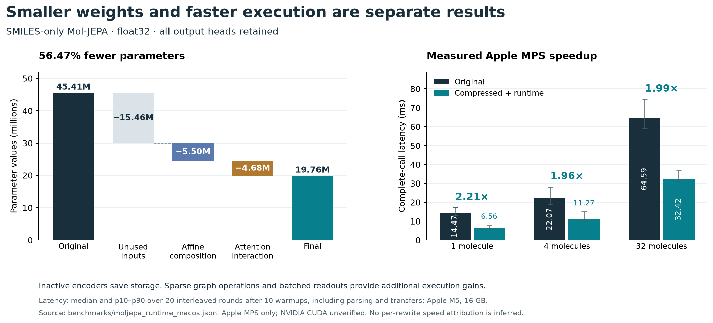

# compressme

Inspect trained weights, pack their files losslessly, and apply validated
PyTorch rewrites when the model contains removable redundancy. The reported
biology-model reductions use no distillation, retraining or precision reduction.

The base package imports neither PyTorch nor biology packages. Model execution
is an optional integration with a trusted architecture and its dependencies.
The [illustrated technical report](docs/technical-report.md) explains the largest
measured gains, focusing on Mol-JEPA.

## Install what you use

From this local checkout:

```bash
python -m pip install -e .                 # Inspection and target registry
python -m pip install -e '.[packing,hub]'  # Lossless files and Hugging Face metadata
python -m pip install -e '.[torch]'        # PyTorch rewrites and validation
```

The package has not been published to PyPI as part of this work. Biology
dependencies are optional. The wheel and source distribution exclude local
checkpoints, vendor checkouts, research archives and environments.
[Installation and model-specific environments](docs/installation.md).

## Reproduce the model results

The tutorials start from a fresh checkout and pinned upstream weights and source,
then build artifacts or apply runtime changes and check complete outputs:

- [Mol-JEPA: SMILES in, all embeddings out](docs/tutorials/moljepa.md).
- [Boltz-2: share confidence and affinity weights](docs/tutorials/boltz2.md).
- [Nesso-1: exact output checks, CPU layout optimisation and lossless packing](docs/tutorials/nesso.md).

Checkpoints and generated tensors are downloaded or created locally and are not
committed. Each tutorial distinguishes model reconstruction, output validation,
storage measurements and timing.

## Build the documentation

```bash
python -m pip install -e '.[docs]'
python -m mkdocs build --strict
python -m mkdocs serve
```

A local Git commit saves the documentation source. Pushing commits or opening a
pull request triggers the documentation workflow, which checks the build and
uploads the generated HTML as an Actions artifact. The repository and its build
artifacts are private; no public documentation site is deployed.
[Build and download instructions](docs/building-docs.md).

## Weights, source repository and CLI

```bash
compressme inspect model.safetensors --repo /path/to/model-repo
compressme inspect organisation/model --revision COMMIT --filename model.safetensors
compressme pack model.safetensors model.cmprpack
compressme unpack model.cmprpack restored.safetensors --max-output-bytes 3221225472
```

Inspection does not execute repository code. `--repo` supplies source context;
a URL alone does not define an inference graph or its input contract. Packing
works on ordinary files and reconstructs all original bytes. It reduces disk
or transfer size; loaded weights and inference arithmetic are unchanged.

To transform a model, supply its trusted local constructor and representative
calls, with the model dependencies installed in that environment:

```bash
compressme compress model.safetensors compressed-model \
  --factory adapter.py:make_model \
  --validation adapter.py:make_examples \
  --method affine --device cpu
```

The CLI strictly loads weights, checks complete outputs and exports only accepted
proposals. An unchanged model is a valid result when no eligible reduction exists.
`--method share` shares identical frozen parameter storage while retaining
parameter enumeration and arithmetic. [CLI reference and runnable adapter](docs/cli.md).

## Measured examples

| Model and contract | Result | Validation boundary |
| --- | --- | --- |
| [Mol-JEPA](https://arxiv.org/abs/2608.22642), SMILES only; all embedding outputs retained | **56.47% fewer parameters; 1.96–2.21× MPS speed** | All tested outputs and requested attentions within 1e-5; finite test inputs |
| [Boltz-2](https://doi.org/10.1101/2025.06.14.659707) confidence and affinity loaded together | **49.55% less joint registered weight storage** | All 48 tested outputs byte-identical on CPU/MPS; no reliable MPS speedup |
| [STATE ST](https://arcinstitute.org/manuscripts/State), original inference and token-ID APIs | **21.25% fewer parameters** | Tested outputs byte-identical on CPU/MPS; no active-compute speedup claimed |



These are output-preservation tests on actual checkpoints, not biological quality
benchmarks. **Apple MPS has been tested. NVIDIA CUDA remains unverified because
no NVIDIA GPU is available.** STATE SE's 28.67% parameter reduction remains
CPU-only. A separate lossless original-table mode now passes byte-exact CPU/MPS
checks and saves 6.31% of registered model-state bytes, but its tested MPS calls
are about five times slower because of decoding. See [STATE modes](docs/state.md).
Full results, including modest and rejected gains,
remain in the [research notes](docs/research-notes.md).

The [backend runner](docs/gpu-validation.md) compares original and transformed
models on the selected device. It reports unavailable hardware as a failure,
not a passed test. GPU performance must be measured on the target backend.

## General Python API

```python
from compressme import compile_affine, Example, validate

result = compile_affine(model.eval())
check = validate(model, result.model, [Example((representative_input,))])
if check["accepted"]:
    result.save("compressed-model")
```

Other reusable passes cover normalisation statistics, frozen embedding rows,
finite-vocabulary encoders and immutable parameter storage. Their structural
conditions and numerical gates are described in the [general workflow](docs/general-workflow.md).

## Project layout

- `src/compressme/`, `tests/`: package, CLI and regression tests.
- `examples/`, `docs/`: local adapters, validation commands and the [draft posts](docs/social-posts.md).
- `benchmarks/`, `experiments/`: measurements, reproduction scripts and negative results.
- `artifacts/`, `vendor/`, `.venv*`: local weights, research checkouts and model environments, excluded from release packages.

Prepared model workflows: [Mol-JEPA](docs/runtime.md), [STATE](docs/state.md),
[Boltz-2](docs/boltz2.md), [Nesso-1](docs/nesso.md). The [optimisation record](docs/optimization-record.md)
keeps accepted, rejected and optional ideas separate. X-Cell and OmniCell are
removed from active scope; stFormer and gated Bioptimus are deferred. Only the
selected NovoMolGen 32M AtomWise variant remains in the supporting research.
