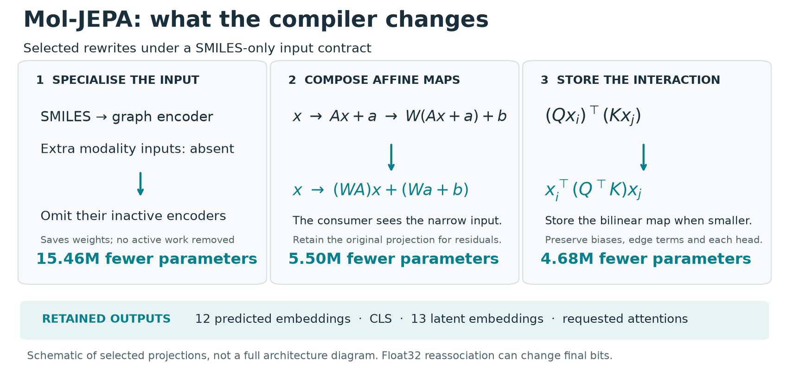

# Reducing inference cost in Mol-JEPA and Boltz-2

**Original models:** [Mol-JEPA, Rottach et al.](https://arxiv.org/abs/2608.22642) · [Boltz-2, Passaro et al.](https://doi.org/10.1101/2025.06.14.659707) · [STATE, Arc Institute](https://arcinstitute.org/manuscripts/State).
{ .original-work }

**compressme technical report · 8 September 2026**

For SMILES-only inference, we reduced the tested Mol-JEPA checkpoint by
**56.47% of its parameters** while retaining all embedding outputs. Complete
calls ran approximately **2× faster on an Apple GPU**. In Boltz-2, sharing
identical weights between the confidence and affinity checkpoints saved
**49.55% of their jointly loaded registered weight storage**.

The Mol-JEPA result combines input specialisation, algebraic composition and
sparse execution. Boltz-2 keeps the original computation and stores shared
weights once. Neither result required retraining, distillation or precision
reduction.

## Mol-JEPA: reduce the active computation

The original multimodal checkpoint has 45,406,721 float32 parameters. For this
experiment, the input contract accepts SMILES with `embeddings_data=None` and
rejects additional modality inputs. The model still returns all 12 predicted
modality embeddings, the CLS vector, all 13 latent embeddings and requested
attention maps.

*Figure 1. The input contract removes unused encoders. Algebraic rewrites replace
oversized intermediate projections with the combinations consumed downstream.
The diagram is schematic; residuals, biases, edge terms and output branches remain.*

Three reductions account for the complete parameter change:

| Transformation | Parameters removed | Why it applies |
| --- | ---: | --- |
| Omit encoders for absent input modalities | 15,462,401 | Those branches are unreachable under the declared SMILES-only contract. They already performed no inference work on this route. |
| Compose the narrow atom projection with its first-layer consumers | 5,504,000 | `W(Ax+a)+b = (WA)x+Wa+b`; consumers can operate on the original 82-feature input. The original expansion remains where the residual needs it. |
| Store eligible query/key interactions as bilinear maps | 4,677,160 | The attention score observes `QᵀK`, allowing a smaller interaction representation while preserving each head and its edge terms. |
| **Total** | **25,643,561** | **45,406,721 → 19,763,160 retained parameters** |

Removing the unused input encoders leaves 29,944,320 parameters. The affine and
attention rewrites then remove another 10,181,160, or **34.00% of that
SMILES-specialised model**. This separates the benefit of narrowing the input
API from the reduction in the representation used for inference.

Sparse bond-only graph preparation, graph kernels that avoid large edge-message
intermediates, fewer device synchronisations and batched readouts then improve
execution. These changes retain all output heads and add no further parameter
reduction. The measured speedup combines these execution changes with the
parameter rewrites, so the parameter count alone does not explain it. [Derivations and prior art](theory.md).

## Complete-call timing and output agreement

*Figure 2. Left: exact parameter accounting. Right: complete-call median latency;
error bars show empirical p10–p90, not confidence intervals. The original and
compressed models receive the same SMILES inputs. [Editable SVG](figures/moljepa-results.svg) · [Data provenance](figures/provenance.json).*

The reference timing run on 7 September used an Apple M5 MacBook Air, 16 GB
unified memory, Python 3.12 and PyTorch 2.14. Each workload had 10 warmups and 20 shuffled, synchronised
rounds. Timings include fresh SMILES parsing, graph construction, device transfers
and every prediction head; loading and first-call shader compilation are excluded.

| Molecules per call | Original median | Compressed median | Speed ratio |
| --- | ---: | ---: | ---: |
| 1 | 14.47 ms | 6.56 ms | 2.21× |
| 4 | 22.07 ms | 11.27 ms | 1.96× |
| 32 | 64.59 ms | 32.42 ms | 1.99× |

All 64 validation SMILES passed complete output and requested-attention checks.
The largest absolute difference was **2.15×10⁻⁶ on MPS** and **4.05×10⁻⁶ on CPU**.
The algebra is exact over real numbers; reassociating floating-point operations
can change the last bits. These measurements establish agreement on the tested
inputs, rather than universal byte identity. [Full timing samples and output metrics](../benchmarks/moljepa_runtime_macos.json).

A fresh MPS revalidation on 8 September passed all 33 SMILES-suite cases and
133 output-tensor comparisons, with the same 2.15×10⁻⁶ maximum error. Repeating
the original model itself changed outputs by up to 1.59×10⁻⁶. Numerical tolerance and byte
identity therefore measure different aspects of agreement.
[Fresh GPU checks](../benchmarks/gpu_validation_2026-09-08_summary.json).

## Boltz-2: share identical checkpoint weights

Boltz-2's confidence and affinity checkpoints have 5,019 common named tensors
with identical bytes. Sharing immutable parameter storage reduces the jointly
loaded models from **4.087 to 2.062 GB of registered weights, a 49.55% saving**.
Logical parameter enumeration and original arithmetic remain unchanged.

All 48 returned tensor outputs matched the original bytes on CPU and MPS,
including fresh reloads, for one 20-residue protein/ethanol fixture with the
standard 200-step schedules. This saving applies when both models are loaded
together; sequentially unloading one model has a different memory baseline.
We did not establish a single-model speedup. Optional conditioning reuse gave
no reliable MPS gain.
[Boltz evidence and limits](boltz2.md).

## How this relates to existing tools

Program specialisation, affine composition, tabulation and weight deduplication
are established techniques. Joint query/key compression also has prior work;
the useful application here handles Mol-JEPA's oversized graph-attention heads,
including their biases and edge features. The [methods notes](theory.md#relationship-to-existing-compression-work)
attribute these ideas and state the conditions of each rewrite.

The practical contribution is finding where these reductions apply to published
checkpoints, retaining the requested outputs, and providing reproducible exports
and measurements. ONNX Runtime already offers graph optimisations and shared
weight initializers. It is a relevant deployment baseline. The approximately
2× Mol-JEPA result above compares with the recorded original PyTorch workflow;
it does not establish a speed advantage over ONNX Runtime.
A separate four-molecule CPU test found that applying the structural rewrites
before ONNX export improved ONNX Runtime calls by 1.63× in median paired timing,
with the same original preprocessing and all embedding and attention outputs.
That fixed-shape test has its own [ONNX Runtime results and limits](onnx.md).

## Transferability and limits

The same passes can apply wherever the model's dataflow supports affine
composition, normalisation statistics, fixed-vocabulary evaluation or immutable
storage sharing. Model names do not determine eligibility. Unsupported or
incompressible models remain unchanged, and each local rewrite must also pass
complete-output comparisons in the enclosing model.

The GPU evidence covers Apple MPS. NVIDIA CUDA remains unverified because no
NVIDIA GPU is available. STATE SE's 28.67% parameter reduction remains CPU-only.
A separate lossless representation of its original table preserves all tested
output bytes on CPU/MPS after reload and saves 6.31% of registered state.
Decoding makes the tested MPS calls about five times slower, so this option
trades execution time for smaller storage. [STATE details](state.md).
Backend-specific kernels and precision settings can change
floating-point results, so CUDA requires its own comparisons against an original
CUDA reference. [GPU validation guide](gpu-validation.md) ·
[PyTorch numerical accuracy](https://docs.pytorch.org/docs/2.14/notes/numerical_accuracy.html).

These tests measure preservation of pretrained outputs. They do not establish
downstream biological accuracy or unrestricted fine-tuning equivalence. The [supporting research notes](research-notes.md)
retain smaller gains and negative experiments. The [CLI](cli.md) can inspect and
pack weights without biology dependencies; semantic rewrites require a trusted
local model constructor and representative inputs.
